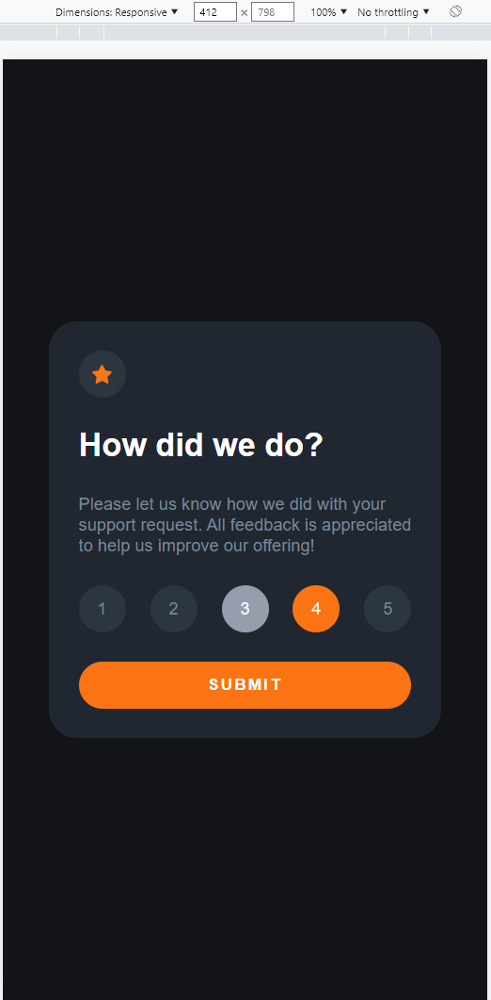
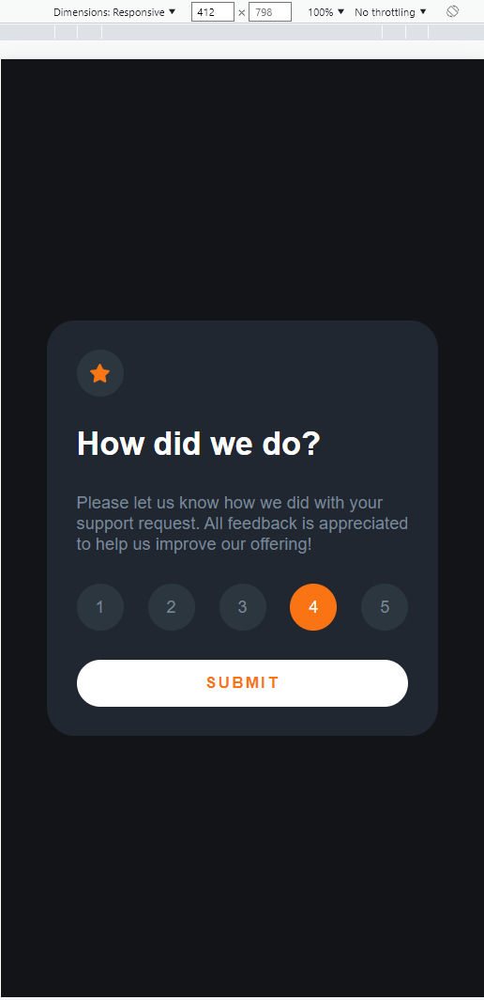
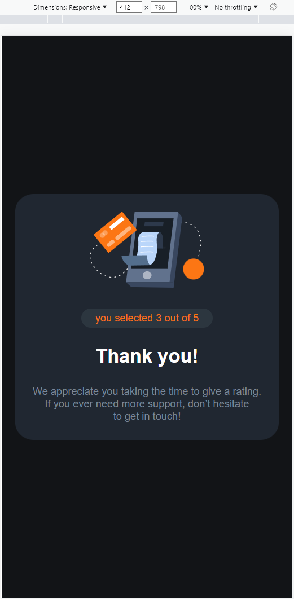

# Frontend Mentor - Interactive rating component solution

This is a solution to the [Interactive rating component challenge on Frontend Mentor](https://nayan458.github.io/Interactive_rating_component/).

## Table of contents

- [Overview](#overview)
  - [The challenge](#the-challenge)
  - [Screenshot](#screenshot)
  - [Links](#links)
- [My process](#my-process)
  - [Built with](#built-with)
  - [What I learned](#what-i-learned)
- [Author](#author)
- [Acknowledgments](#acknowledgments)

## Overview

This project is build as a challenge of frontend mentor. This a project on buildinf simple user interface for rating. This a very basic project build in html,css and javascript.

### The challenge
Your challenge is to build out this interactive rating component and get it looking as close to the design as possible.

You can use any tools you like to help you complete the challenge. So if you've got something you'd like to practice, feel free to give it a go.

Your users should be able to:

View the optimal layout for the app depending on their device's screen size
See hover states for all interactive elements on the page
Select and submit a number rating
See the "Thank you" card state after submitting a rating
### Screenshot

### Links

- Solution or code URL: (https://github.com/nayan458/rating_compo)
- Live Site URL: (https://nayan458.github.io/rating_compo/)

## My process
First : designed the layout for desktop using html and css(grid and flex mainly)
Second : added proper parameters to the components(such as color, pading, fontsize, fontfamily etc)
Third : added the javascript and neccesary ids to the component.
Fourth : made it responsive.

### Built with
-HTML
-CSS
-JAVASCRIPT

### What I learned
I found out a new way to access class in javascript using map and reduce the overwritinig. I was not sure about it at the starting but it worked at once. I think the best part of this project is the javascript file thats here. Its a pure javascript and nothing extraordinary.

I also polished my skills on grids and once learned grid in css its always a advantage

## Author
Nayanmoni Baruah

## Acknowledgments
I am thankfull of frontend mentor for providing such challenges it is truelly helpfull for students and encourage us to learn skills wiithout hinderance.
    
Also it always take care of develops who are at the beginner stage as they provide all the requirement staf on starting the challenge so that the developers can focus on code more than other stafs. For example svg images

I have been always been helpfull of github as it provides a plateform for developers to deploy there code in ease.

    